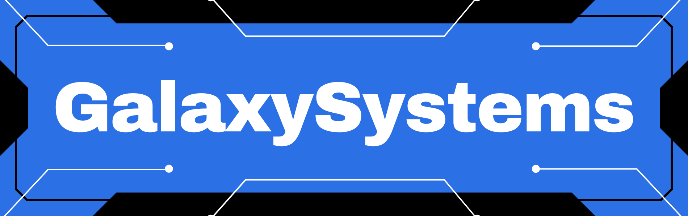

# 😎 Kdo jsme?

## Jsme soukromá organizace zabývající se vývojem kvalitního softwaru na míru.

# 💎 Specializace

## - Tvorba pokročilých webových aplikací
## - Kybernetická bezpečnost
## - Networking 
## - Webdesign
## - Hosting

# 📜 Technologie

## Jazky

## Frameworky

## Ostatní

 

